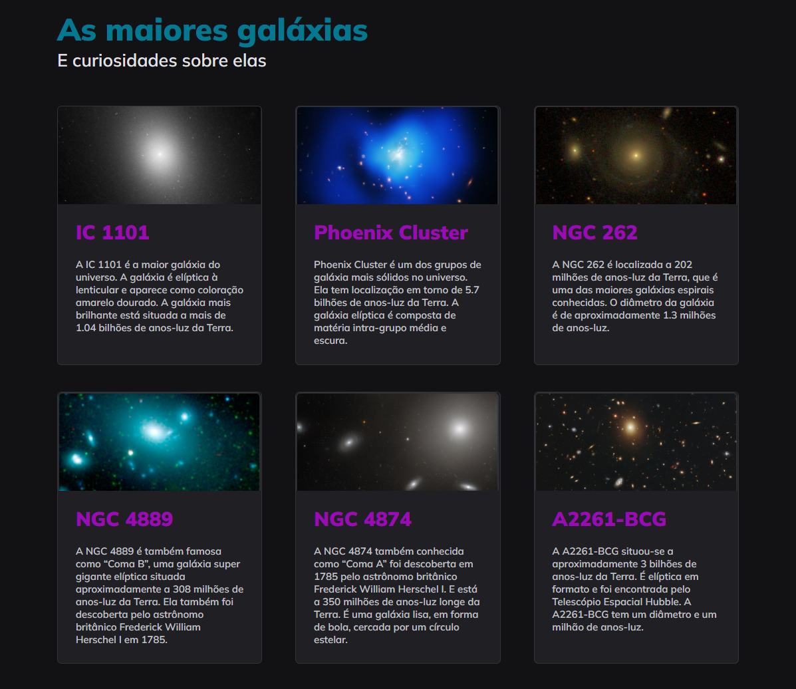

## 💻 Projeto

# Galaxies

Este é um projeto simples que apresenta informações sobre algumas das maiores galáxias conhecidas no universo. O site exibe dados sobre essas galáxias, incluindo seu nome, uma breve descrição e uma imagem ilustrativa. É uma oportunidade para os entusiastas da astronomia aprenderem mais sobre esses objetos fascinantes que estão a bilhões de anos-luz da Terra.

 

  
  

  ## 📝 Licença

Esse projeto está sob a licença MIT. Veja o arquivo [LICENSE](LICENSE) para mais detalhes.